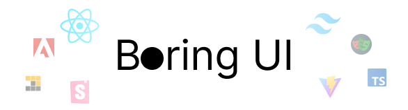

> [!Note]
>
> _"There were lots of holidays and I was bored so I tried creating a Components Library for fun and to try things out. Please bear with me as this is an ongoing work and there's still a lot to do."_

## Technologies Used

- `pnpm`
- React with Vite
- React Aria
- TailwindCSS
- Storybook

## Development Setup

1. Clone the repo.
2. Install the dependencies using `pnpm`

```bash
pnpm i
```

3. Run the Storybook

```bash
pnpm storybook
```

This will build Tailwind and start an instance of Storybook in port [6006](http://localhost:6006/).

## To do

- Either implement Playwright or Chromatic for testing.
- Deploy the package in GitHub Packages.
